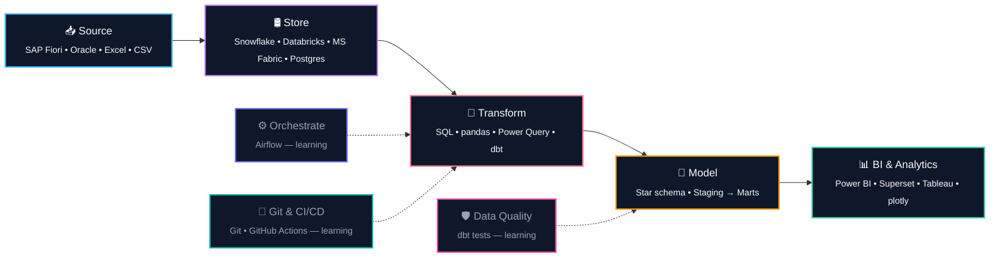

<!--
  GitHub Profile README — duyngoduyngo
  Push to a repo named exactly: duyngoduyngo/duyngoduyngo (public)
  Only thing left to check: the dates in the Professional Journey table.
-->

<div align="center">
  
</div>

<p align="center">
  
</p>

<p align="center">
  <a href="mailto:duyngoduyngo@gmail.com"></a>&nbsp;
  <a href="https://www.linkedin.com/in/duyngoduyngo/"></a>&nbsp;
  <a href="https://github.com/duyngoduyngo?tab=repositories"></a>&nbsp;
  
</p>


## 🧭 About Me

```yaml
analytics_engineer_in_transition:
  now: "Reporting & data analytics inside a bank's technology procurement team"
  next: "Analytics Engineering — owning the transformation layer, not just the dashboard"
  philosophy: "If only one person can rebuild the report, it isn't a data product yet."
  background:
    - "B.A. Finance & Banking — Academy of Finance"
    - "Airline distribution & planning (Sabre Vietnam)"
    - "Banking operations & technology procurement (VPBank, Agribank)"
  what_i_actually_do:
    reporting_automation:
      - "Extract from SAP Fiori, reshape in Power Query, publish in Power BI"
      - "Replaced manual monthly reporting cycles with refreshable models"
    analysis:
      - "Unit economics, cohort retention, conversion funnels, market basket"
      - "Vendor spend, procurement cycle time, budget variance"
    learning_in_public:
      - "Rebuilding my Power Query logic as version-controlled dbt models"
      - "Star-schema modelling, dbt tests, Git-based analytics workflow"
  why_analytics_engineering: >
    Most of my time was never spent analysing — it was spent transforming.
    That layer lived in my head and in ten thousand clicks. AE is the
    discipline that turns it into code someone else can read.
```


## 💼 Professional Journey

<div align="center">
  <table width="100%">
    <tr>
      <td align="center" valign="top" width="22%">
        <sub>Internship</sub><br /><br />
        <br /><br />
        <a href="https://www.agribank.com.vn/"><b>Agribank</b></a><br />
        <sub>Banking Intern</sub>
      </td>
      <td align="center" valign="middle" width="2%">➔</td>
      <td align="center" valign="top" width="22%">
        <sub>2020 - 2025</sub><br /><br />
        <br /><br />
        <a href="https://www.sabre.com/"><b>Sabre Vietnam</b></a><br />
        <sub>Planning &amp; Data Analytics</sub>
      </td>
      <td align="center" valign="middle" width="2%">➔</td>
      <td align="center" valign="top" width="22%">
        <sub>2025 - </sub><br /><br />
        <br /><br />
        <a href="https://www.vpbank.com.vn/"><b>VPBank</b></a><br />
        <sub>Technology Procurement &amp; Reporting</sub>
      </td>
      <td align="center" valign="middle" width="2%">➔</td>
      <td align="center" valign="top" width="22%">
        <sub>Target</sub><br /><br />
        <br /><br />
        <b>Analytics Engineer</b><br />
        <sub>Banking / FinTech</sub>
      </td>
    </tr>
  </table>
</div>


## 🛠️ Tech Stack &amp; Ecosystem



<sub>Solid boxes = used in real work. Dotted boxes = currently building fluency.</sub>

<br/>

<div align="center">
  <table width="100%">
    <tr>
      <td width="25%"><b>🔄 Transform &amp; Query</b></td>
      <td width="75%">
        
        
        
        
        
        
        
      </td>
    </tr>
    <tr>
      <td><b>🛢️ Store &amp; Platform</b></td>
      <td>
        
        
        
        
        
        
      </td>
    </tr>
    <tr>
      <td><b>📊 BI &amp; Visualization</b></td>
      <td>
        
        
        
        
        
        
      </td>
    </tr>
    <tr>
      <td><b>⚙️ Orchestrate &amp; Quality</b></td>
      <td>
        
        
        
      </td>
    </tr>
    <tr>
      <td><b>🚀 Git &amp; CI/CD</b></td>
      <td>
        
        
      </td>
    </tr>
    <tr>
      <td><b>🏢 Business Systems</b></td>
      <td>
        
        
        
      </td>
    </tr>
    <tr>
      <td><b>💻 IDE &amp; Tools</b></td>
      <td>
        
        
        
        
      </td>
    </tr>
  </table>
</div>


## 📂 Featured Project

<div align="center">
  <a href="https://github.com/duyngoduyngo/smarttoys-ecommerce-analytics">
    
  </a>
</div>

### 🧸 [SmartToys — Business Review &amp; Growth Strategy](https://github.com/duyngoduyngo/smarttoys-ecommerce-analytics)

A full business review of a 3-year e-commerce dataset: **472,871 sessions**, **32,313 orders**, 1.1M+ pageviews across 6 relational tables. The goal wasn't a dashboard — it was answering why gross revenue and actual profit had drifted apart.

**Three findings that changed the recommendations:**

- **The business has almost no customer lifecycle.** 98.14% of customers bought exactly once; revenue per customer ($61.16) is essentially the AOV. Every unit of growth had to be repurchased with new ad budget.
- **Mobile is the expensive leak.** 30.8% of traffic converting at 3.09% against desktop's 8.50% — and the gap holds across *all four* traffic sources, which points at the interface rather than traffic quality. Closing it is worth roughly **$473K**.
- **The most profitable product is buried.** Highest net margin (67.08%), lowest refund rate, best add-to-cart rate — but 62× fewer category-page clicks than the flagship. A merchandising problem, not a product problem.

Eight prioritised recommendations, each tied to a specific metric and an owning team. The README also documents where the analysis **can't** support a conclusion — RFM frequency capped at three values, market-basket lift below 1 across all pairs, no refund-reason field.

`Python` `pandas` `numpy` `plotly` `seaborn` · Unit economics · RFM · Cohort retention · Sankey · Funnel · Market Basket

<br/>

<div align="center">
  <table width="100%">
    <tr>
      <td width="50%" valign="top" align="center">
        <h4>🧱 dbt Analytics Project</h4>
        <sub></sub>
        <p>Rebuilding the SmartToys logic as layered dbt models — staging → intermediate → marts, with tests and docs.</p>
      </td>
      <td width="50%" valign="top" align="center">
        <h4>⚙️ Orchestrated Pipeline</h4>
        <sub></sub>
        <p>Scheduled ingestion + transformation with Airflow, versioned in Git with CI checks on every PR.</p>
      </td>
    </tr>
  </table>
</div>


## 📈 Activity &amp; Stats

<div align="center">
  
  
</div>

<div align="center">
  
</div>


## 🎓 Certifications &amp; Training

```sql
SELECT credential, provider, status
FROM   my_learning
ORDER  BY relevance_to_analytics_engineering DESC;
```

| Credential | Provider | Status |
|---|---|---|
| Snowflake Bootcamp — modern data warehousing | Snowflake | ✅ Completed |
| Databricks Lakehouse Bootcamp | Databricks | ✅ Completed |
| Microsoft Fabric Bootcamp | Microsoft | ✅ Completed |
| Data Analyst in Python | DataCamp | 🔄 In progress |
| dbt Fundamentals | dbt Labs | 🔄 In progress |
| B.A. Finance &amp; Banking | Academy of Finance | 🎓 Graduated |
| TOEIC 840 | ETS | ✅ Certified |


## 🧩 GET /api/v1/fun-facts

```json
{
  "status": "Open to Analytics Engineer / Senior Data Analyst roles",
  "location": "Hanoi, Vietnam — remote friendly",
  "languages": ["Vietnamese (native)", "English (TOEIC 840)"],
  "domains": ["Banking", "Airline distribution", "Procurement", "E-commerce"],
  "favorite_stack": ["SQL", "dbt", "Power BI"],
  "unfair_advantage": "I sat in the meetings where the metric was defined",
  "always_include": "A section on what the data cannot tell you",
  "fun_fact": "Started in Finance, detoured through airline planning, landed in data"
}
```


<div align="center">
  
</div>
