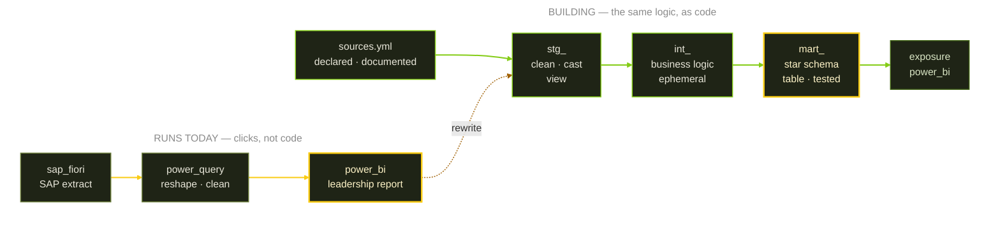

<!--
  GitHub Profile README — duyngoduyngo
  Repo: duyngoduyngo/duyngoduyngo  (public, named exactly your username)

  This README is fully self-contained — no image files to commit.
  Safe to delete from the repo: assets/ (lineage.svg, pipeline.svg), lineage.html

  Still to check: the dates in the Professional Journey table.
-->

<div align="center">
  
</div>

<p align="center">
  
</p>

<p align="center">
  <a href="mailto:duyngoduyngo@gmail.com"></a>&nbsp;
  <a href="https://www.linkedin.com/in/duyngoduyngo/"></a>&nbsp;
  <a href="https://github.com/duyngoduyngo?tab=repositories"></a>&nbsp;
  
</p>


## 🧭 About Me

```yaml
analytics_engineer_in_transition:
  now: "Reporting & data analytics inside a bank's technology procurement team"
  next: "Analytics Engineering — owning the transformation layer, not just the dashboard"
  philosophy: "If only one person can rebuild the report, it isn't a data product yet."
  background:
    - "B.A. Finance & Banking — Academy of Finance"
    - "Airline distribution & planning (Sabre Vietnam)"
    - "Banking operations & technology procurement (VPBank, Agribank)"
  what_i_actually_do:
    reporting_automation:
      - "Extract from SAP Fiori, reshape in Power Query, publish in Power BI"
      - "Replaced manual monthly reporting cycles with refreshable models"
    analysis:
      - "Unit economics, cohort retention, conversion funnels, market basket"
      - "Vendor spend, procurement cycle time, budget variance"
    learning_in_public:
      - "Rebuilding my Power Query logic as version-controlled dbt models"
      - "Star-schema modelling, dbt tests, Git-based analytics workflow"
  why_analytics_engineering: >
    Most of my time was never spent analysing — it was spent transforming.
    That layer lived in my head and in ten thousand clicks. AE is the
    discipline that turns it into code someone else can read.
```


## 💼 Professional Journey

<div align="center">
  <table width="100%">
    <tr>
      <td align="center" valign="top" width="22%">
        <sub>Internship</sub><br /><br />
        <br /><br />
        <a href="https://www.agribank.com.vn/"><b>Agribank</b></a><br />
        <sub>Banking Intern</sub>
      </td>
      <td align="center" valign="middle" width="2%">➔</td>
      <td align="center" valign="top" width="22%">
        <sub>2020 - 2025</sub><br /><br />
        <br /><br />
        <a href="https://www.sabre.com/"><b>Sabre Vietnam</b></a><br />
        <sub>Planning &amp; Data Analytics</sub>
      </td>
      <td align="center" valign="middle" width="2%">➔</td>
      <td align="center" valign="top" width="22%">
        <sub>2025 - </sub><br /><br />
        <br /><br />
        <a href="https://www.vpbank.com.vn/"><b>VPBank</b></a><br />
        <sub>Technology Procurement &amp; Reporting</sub>
      </td>
      <td align="center" valign="middle" width="2%">➔</td>
      <td align="center" valign="top" width="22%">
        <sub>Target</sub><br /><br />
        <br /><br />
        <b>Analytics Engineer</b><br />
        <sub>Banking / FinTech</sub>
      </td>
    </tr>
  </table>
</div>


## 🛠️ Tech Stack &amp; Ecosystem

The honest version of my stack is a migration in progress. The top lane ships today; the bottom lane is the same logic being rebuilt as version-controlled code.



### Where each tool actually comes from

| Layer | Tools | Where I've used them |
|---|---|---|
| **Transform &amp; query** |     | SQL and Power Query daily at VPBank; pandas across the SmartToys analysis; dbt on the rebuild |
| **Modelling** | `star schema` `staging → marts` `dbt tests` | dbt Fundamentals completed; applying it to the SmartToys models now |
| **Warehouse &amp; platform** |     | Bootcamps on all three; evaluated them as platforms while doing tech procurement in a bank |
| **BI &amp; visualization** |     | Power BI in production for leadership reporting; plotly throughout SmartToys |
| **Orchestration** |  | Learning. Not in production yet — the honest gap in this list |
| **Version control** |   | Every project repo here; CI on the dbt rebuild |
| **Business systems** |   | SAP Fiori extracts (QT0304) and Power Apps at VPBank |


## 📂 Featured Project

### 🧸 [SmartToys — Business Review &amp; Growth Strategy](https://github.com/duyngoduyngo/smarttoys-ecommerce-analytics)

<p>
  
  
  
  
  
  
</p>

A full business review of a 3-year e-commerce dataset across 6 relational tables. The goal was never a dashboard — it was explaining why gross revenue and actual profit had drifted apart.

**Three findings that drove the recommendations:**

| Finding | Evidence | So what |
|---|---|---|
| **No customer lifecycle** | 98.14% bought exactly once; revenue per customer $61.16 ≈ AOV | Every unit of growth had to be repurchased with new ad budget |
| **Mobile is the expensive leak** | 30.8% of traffic at 3.09% CR vs desktop 8.50% — gap holds across *all four* sources, so it's the interface, not traffic quality | Closing it is worth roughly **$473K** |
| **Best product is buried** | Highest net margin (67.08%), lowest refunds, best add-to-cart — but 62× fewer category clicks than the flagship | Merchandising problem, not a product problem |

Eight prioritised recommendations, each tied to a metric and an owning team. The README also documents where the analysis **can't** support a conclusion — RFM frequency capped at three values, market-basket lift below 1 across every pair, no refund-reason field in the source data.

`Unit economics` · `RFM` · `Cohort retention` · `Sankey` · `Conversion funnel` · `Market basket`

<br/>

<div align="center">
  <table width="100%">
    <tr>
      <td width="50%" valign="top" align="center">
        <h4>🧱 dbt Analytics Project</h4>
        
        <p>Rebuilding the SmartToys logic as layered dbt models — staging → intermediate → marts, with tests and generated docs.</p>
      </td>
      <td width="50%" valign="top" align="center">
        <h4>⚙️ Orchestrated Pipeline</h4>
        
        <p>Scheduled ingestion and transformation with Airflow, versioned in Git with CI checks running on every pull request.</p>
      </td>
    </tr>
  </table>
</div>


## 📈 Activity &amp; Stats

<div align="center">
  
  
</div>


## 🎓 Certifications &amp; Training

| Credential | Provider | Status |
|---|---|---|
| dbt Fundamentals | dbt Labs | ✅ Completed |
| Data Analyst in Python | DataCamp | ✅ Completed |
| Associate Data Analyst in SQL | DataCamp | ✅ Completed |
| Snowflake Bootcamp — modern data warehousing | Snowflake | ✅ Completed |
| Databricks Lakehouse Bootcamp | Databricks | ✅ Completed |
| Microsoft Fabric Bootcamp | Microsoft | ✅ Completed |
| B.A. Finance &amp; Banking | Academy of Finance | 🎓 Graduated |
| TOEIC 840 | ETS | ✅ Certified |


## 🧩 GET /api/v1/fun-facts

```json
{
  "status": "Open to Analytics Engineer / Senior Data Analyst roles",
  "location": "Hanoi, Vietnam — remote friendly",
  "languages": ["Vietnamese (native)", "English (TOEIC 840)"],
  "domains": ["Banking", "Airline distribution", "Procurement", "E-commerce"],
  "favorite_stack": ["SQL", "dbt", "Power BI"],
  "always_include": "A section on what the data cannot tell you",
  "fun_fact": "Started in Finance, detoured through airline planning, landed in data"
}
```


<div align="center">
  
</div>
